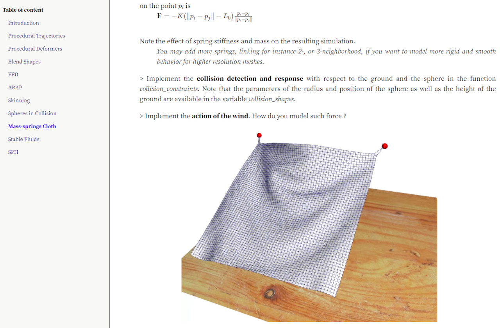

# INF585 Computer Animation - Lab Class Description


## Download

```
git clone --recursive https://github.com/drohmer/inf585_lab_class
```

## Run

```
python generate.py
```

_Slides are generated in \_site/ directory_

<p align="center"> 

</p>


## Links

* [INF585 Lab class](https://damienrohmer.com/data/teaching/2022_2023/x-inf585/practice/index.html) 

* [INF585 Course Website](https://damienrohmer.com/data/teaching/2022_2023/x-inf585)

* [INF585 Lab class code](https://github.com/drohmer/inf585_code)

* [CGP Library](https://imagecomputing.net/cgp) [ [source](https://github.com/drohmer/cgp) ]

